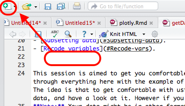
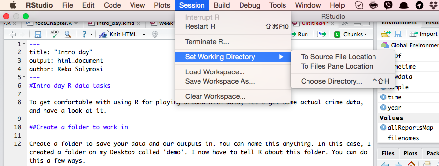
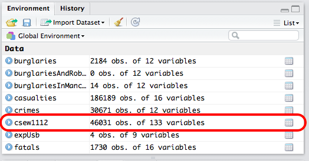

**Table of Contents**

- [Writing code](#Writing-code)
- [Create a forler to work in](#Create-a-folder-to-work-in).
- [Loading packages](#Loading-packages).
- [Get some data](#Get-some-data).
- [Read the data into R](#Read-the-data-into-R).
- [Explore the data](#Explore-the-data).
- [Subsetting data](#Subsetting-data).
- [Recode variables](#Recode-vars).


This session is aimed to get you comfortable with having a play with your data set in R Studio. We go through everything here with the example of crime survey for england and wales (csew) data from the UKDS. The idea is that to get comfortable with using R for playing around with data, we can get some actual data, and have a look at it. However if you prefer go do this with your own data from the start, go ahead.
**Note:** Your data might be in other formats. See [this handy guide of reading in different files into R](https://www.datacamp.com/community/tutorials/r-data-import-tutorial). 
*Tip*: If you're not sure which file type you have, put the file extension (eg ".tab" or ".sav") into google. 

##Writing code {#Writing-code}
Hopefully you will have followed the instructions to install R and R Studio and familiarised yourself with writing code in R Studio. 

In order to write your code, and be able to save it later, you want to create a new .R document. You do this using the doc with green plus sign in the top left corner of R Studio:



You can then write all your code in here. To run it, you just highlight all the code and hit ctrl+Enter or click on run on the top right hand corner, and you execute the code. To save it, you go to file> save and then you can always access your code later here. 

##Create a folder to work in {#Create-a-folder-to-work-in}

Create a folder to save your data and our outputs in. In R, this is known as a **working directory**. You can name this anything. It is important because all your outputs will be saved, and also all your data that you import should be saves in this folder as well. 

In this case, I created a folder called 'demo' inside the folder that has the course notes. I now have to tell R about this folder. You can do this a few ways. 

####One way is simple point and click: 

Click on Session > Set working directory > Choose directory...



Then navigate to the folder you want to use, open it, and click on 'Open'.

####Or the other way is to use code (you need to know the filepath for this):

The command to set working directory is `setwd()`. Inside the brackets you need to write the path to your folder, in quotation marks. So for me this is: 

```{r, eval=FALSE}
setwd("~/Desktop/R-for-Criminologists/demo")
```

Whichever way you choose, once you have done this you can save all data in this folder, and read them in from here. Also any outputs like plots and code get saved here as well.  

##Loading packages {#Loading-packages}

Often to run a bit of code you will have to install packages. Packages are bundles of code that someone else has written, and uploaded to a central repository (called CRAN) so that anyone can download and use them. These packages have lots and lots of functions in them, which we can use, and also sometimes some data sets. 

Different packages are used for different things we want to achieve. For example, this week we will use the `dplyr` package, in order to manipulate our data. 

Packages need to be downloaded only once, but they need to be **called** every time you use them. 

To download the package you use the `install.packages()` function. So to download the dplyr package for example we used

```{r, eval=FALSE}
install.packages("dplyr")
```

Remeber, you only ever have to do this once on your computer. If you quit R and then start it up again a week later, the package should still be there. 

**Loading** it on the other hand, you have to do every time you start a new R session. That just means if you close R Studio today, and open it back up in a week, and you want to run a function that comes from a package, you need to load that package into your current session first. 

You do this by ysing the `library()` function. So to load dplyr into your session, you need to run:

```{r, eval=FALSE}
library(dplyr)
```

To see what packages you currently have loaded in your session, you use the `search()` function (you do not need to pass it any objects in this case)

```{r}
search()
```

To find out mode about packages see [here](http://www.statmethods.net/interface/packages.html).


##Get some data {#Get-some-data}

We can play around with crime survey data, which can be downloaded from the UKDS. To download this data, you must go to the UK Data Service website, register, and download the following data set: 
**Crime Survey for England and Wales, 2011-2012: Teaching Dataset**
[if you're really struggling to find it, the link is here](https://discover.ukdataservice.ac.uk/catalogue/?sn=7401&type=Data%20catalogue)

You will have to register to download this data.
When downloading the file you will be given the choise of different formats. 
Save the file in `.tab` delimited format. 
You will download a .zip folder, you will have to unzip this, and find the .tab file. 
In this case, it will be called csew1112.tab. 
Move that file into your *working directory* folder. 

Then you could adapt the code below to read it into R.
```{r}
csew1112 <- read.table("csew1112.tab", sep="\t", header=TRUE)
```

##Read the data into R {#Read-the-data-into-R}

R reads in data in the form of dataframes. This is essentially the same as a spreadsheet. You have columnds that represent your **variables**. And rows that reporesent your **observations**

So for example, in this data set each row is one person who answered the survey.


And this column for example is the month variable. Each observation (response) will have a value for this variable (the month that it was recorded).


So that is essentially a dataframe. So let's read in the downloaded and unzipped crime survey data into a dataframe. 

To do so, you need to create a dataframe object, that you map the data onto. So you need to give it a name, and then read the file into it. This name is what you will use to call the dataframe. Here I simply call it `csew1112`. 

<!--
To read in the .csv file, which is the format we just downloaded, the command is `read.csv`. 

Again there are two ways to read in the data, if you want to open a window where you can manually navigate and open the file, you can pass `file.choose()` argument to the read.csv() function. 

```{r, eval=FALSE}
crimes <- read.csv(file.choose())
```

Or, if you know the path to your file, you can hardcode it in there, within quotation marks:

```{r, eval=FALSE}
crimes <- read.csv("2016-06/2016-06-greater-manchester-street.csv")
```

```{r, echo=FALSE}
crimes <- read.csv("2016-06-greater-manchester-street.csv")
```

You might notice that `crimes` has appeared in your work environment window. It will tell you how many observations (rows - and incidentally the number of recorded crimes in June 2016 within the GMP jurisdiction) and how many variables (columns) your data has.
-->


##Explore the data {#Explore-the-data}

As seen earlier, we can just have a look at our data using the `View()` function. 

```{r, eval=FALSE}
View(csew1112)
```

###What are some variables in this data? 

What are the variables? 
What are some questions that you might ask that you could answer with this data?

####Some possibilities

#####Q1: How many people were interviewed in the 2011/2012 CSEW?

A1: You can check this a few ways (eg: look in your environment, or the bottom of the data view) but I like explicitly asking R to tell me things, so I will ask it to count the **N**umber of **ROW**s with the `nrow()` function. 

```{r}
nrow(csew1112)
```

There were a total of 46,031 people interviewed for the 2011/2012 CSEW.

#####Q2: What are variables in this data?
There are a few ways to find this out. One option is to use the `names()` function, but in this dataset we have a lot of variables! (113 to be exact) To find out about the ones we're interested in, we can refer to the code book. This can be online, or can be downloaded with your data set. In the case of the CSEW data were using here, the documentation is in that folder you unzipped. It's called `7401csew_2011-2012_teaching_dataset_user_guide.pdf`. 

#####Q3: Find out about one variable?

Let's say we're interested in the variable `walkdark`, which has the answers people gave to the question: `How safe do you feel walking alone after dark?`
We could for example want to see what people answer to this question to do this, you could make a frequency table using the `table()` command. A frequency table just counts the number of times that each value the variable can take appears in the dataframe. Since each row is one response, each time the response type appears, one more instance of it can be counted. So a frequency table returns the frequency with which we see each answer in our data.

Step 1: create table
```{r}
frequencyTableOfWalkdark <- table(csew1112$walkdark)
frequencyTableOfWalkdark
```

Since there are not too many possible answers we can probably eyeball which value of the variable highest number of appearances in the data (frequency). However, I am lazy, so let's get R to tell me the answer instead, by sorting the table. 

You can use the `sort()` command to then arrange this table. You can set the parameter of `decreasing` to **T**rue or to **F**alse, depending on how you want to sort the data. 

Step 2: sort table
```{r}
sort(frequencyTableOfWalkdark, decreasing=T)
```

The most common response is `2`.

But what does this mean? Again we can refer back to the codebook and we can see that `1` means `Very safe`, `2` means `Fairly safe`, `3`  means `A bit unsafe`, and `4` means `Very unsafe`. 

You probably don't want to look this up every time, so it's also possible to recode your variables. The next section shows you how. 

##Recode variables {#Recode-vars}

You will often encounter cases when your variables are given numeric values, as above, even though they are not numeric, but factors. In order to recode them, we can use the `dplyr` package, which we talked about loading in the `packages` section. 

If you haven't already, then load the dplyr packages using the `library()` function: 
```{r}
library(dplyr)
```

From the dplyr package you can use the `recode()` function. You need to pass it first the name of the variable, (calling it with the dataframe$column_name syntax), and then each value. You can use the following code for the `walkdark` variable for example: 

```{r}
csew1112$walkdark <- recode(csew1112$walkdark, `1`= "Very safe", `2`= "Fairly safe",  `3`= "A bit unsafe", `4`= "Very unsafe")
```

Always make sure to check that you are recoding correctly - use the codebook provided with your data to verify. 

<!--A4: One of the variables in the dataset is labelled `LSOA.name`. LSOA stands for Lower Level Super Output Area, and it is a geographical region that the Greater Manchester region (and all of the UK actually) is broken into. These areas are often used as proxys for identifying neighbourhoods. More on LSOAs can be found [here](http://webarchive.nationalarchives.gov.uk/20160105160709/http://www.ons.gov.uk/ons/guide-method/geography/beginner-s-guide/census/super-output-areas--soas-/index.html).

One interesting question would be to compare crimes between these neighbourhoods. Let's just look at total number of crimes in each neighbourhood. 

Above with Q3 we talked about how we can make a quick frequency table. This table tells us how many times each LSOA name appears in the data. As every row in the `crimes` dataframe is a crime incident, every time the LSOA name appears, it is a crime incident that happened in that neighbourhood. Therefore if we count the number of times each LSOA name appears in the list of crimes, we then find out how many crimes occurred there in June 2016. 

But of course we want R to count for us, so as before, to create a table, we use the `table()` funciton. Simples.

```{r}
crimesPerLsoa <- table(crimes$LSOA.name)
```

At this moment, this is a table. There is less scope for manipulation with tables than with dataframes in R, so let's turn it into a dataframe. You might be noticing that R commands are pretty much like telling the computer what you want it to do in English. So the command to turn something into a dataframe is `to.data.frame`. 

```{r}
crimesPerLsoaDf <- as.data.frame(crimesPerLsoa)
```

Let's have a look at this new dataframe. 

```{r, eval=FALSE}
View(crimesPerLsoaDf)
```

With viewing the dataframe, we also see that the column titles are `Var1` and `Freq`. This is because we created a **FREQ**uency table of the neighbourhood **VAR**iable. Basically variable here is neighbourhod, and frequency is the number of crimes that were recorded in each. 

If we want to, for clarity we can rename these. Don't worry too much about the syntax at this point.

```{r}
colnames(crimesPerLsoaDf)[colnames(crimesPerLsoaDf)=="Var1"] <- "neighbourhood"
colnames(crimesPerLsoaDf)[colnames(crimesPerLsoaDf)=="Freq"] <- "numCrimes"
```

***What are the variables in the new dataframe?***

You can get a list of the variables in the dataframe using the `names()` function: 
```{r}
names(crimesPerLsoaDf)
```

***What are the observations (ie what does each row represent?)***

So one of the variables is the number of crimes, and each row is a neighbourhood. In order to get the average number of crimes in each neighbourhood we calculate the mean. Mean means average in statistics language. Same way you calculate the average, you can calculate the mean by adding up all the values, and then dividing by the total number of observations. 

```{r}
sum(crimesPerLsoaDf$numCrimes)/nrow(crimesPerLsoaDf)
```

But of course, we are lazy, and want to make the most of R's capabilities, so we can just use the ... `mean()` function!

```{r}
mean(crimesPerLsoaDf$numCrimes)
```

There are an average of 18 crimes per neighbourhood across Greater Manchester.
-->
##Subsetting data {#Subsetting-data}

One common data manipulation technique is subsetting data. Sometimes you want to select only instances of your data where a certain condition is met. For example, you want only those people who answered they were "Very safe" about walking alone after dark.

You can filter data with the `subset()` function. 

As arguments you need to specify the thing you are subsetting (eg: dataframe or vector) and then the filtering condition/ criteria. So something like this: 

`subsetDf <- subset(nameOfOriginalDf, nameOfDf$columnName=="myCriteria")`

The equals operator in R is a double equals "==". This is because a single equals can be used to assign something a value (sort of like the "<-" operator). == instead asks a question, "does one value equal the other?".

So for example 1 == 2 returns FALSE while 2 == 2 returns true. Try it!

```{r}
1==2
2==2
```

So == is a way to test if some criteria is met. This is why we use that to select rows where a criteria is met. 

So to test whether an observation (row) meets the criteria, we can test for each row whether the == returns true or false. In the subsetting, we get back all the rows where == returned TRUE. 

So to return to the csew data, to subset only the rows where respondents answered 'very safe': 

```{r}
verySafeOnly <- subset(csew1112, csew1112$walkdark=="Very safe") 
```

Now you can see you have a lot fewer rows (only the ones who are Very safe)

```{r}
nrow(verySafeOnly)
```

You can also subset with multiple criteria. In this case we can select both very and fairly safe:: 

```{r}
verySafeAndFairlySafe <- subset(csew1112, csew1112$walkdark=="Very safe" | csew1112$walkdark=="Fairly safe") 
```

Now you can see the number of people that are either very or fairly safe:
```{r}
nrow(verySafeAndFairlySafe) 
```

To do this you used the `or "|"` operator, becaues we select a case if the level of worry is feeling very **OR** fairly safe. You can also use `and "&"` operator, in case that you want to select rows that meet multiple criteria. 

For example, if you want people who are very safe and also male (variable: `csew1112$sex`), we have to select all those where sex is 1 (if you look at codebook you can see, 1 is Male, and 2 is Female): 

```{r}
verySafeMen <- subset(csew1112, csew1112$walkdark=="Very safe" & csew1112$sex==1) 
```

Now you can see the number of burglaries in this neighbourhood:
```{r}
nrow(verySafeMen) 
```

These are some ways to select those rows where certain criteria is met. You can also select certain columns. Let's say we want a dataframe that has only two columns, `walkdark` and `sex`. You can use the select() function from the dplyr package as well, which we loaded earlier for using recode(). 

To the select() function you first pass the dataframe, and then the column names of the ones you want. So in this case, your code for a new datarame (aptly named `newDataFrame`) would look like this: 

```{r}
newDataFrame <- select(csew1112, walkdark, sex)
```

##More on recoding: converting a factor into a numeric variable

You often want to create a composite measure. I'm sure you learned about constructs, variables that are measured by multiple indicators. There are various ways of compiling these together into one numeric variables. For one very simplistic example, we can create a numeric value of worry while walking, based on the answer in day and night. For this, we need to recode our factor of walkdark that we previously recoded to be factor. 

Let's call this new variable walkdark_num: 

```{r}
csew1112$walkdark_num <- recode(csew1112$walkdark, "Very safe" = 1, "Fairly safe" = 2,  "A bit unsafe" = 3, "Very unsafe" = 4)
```

Let's quickly check the type of walkdark_num and also the variable walkday (fear while walking in daytime) to make sure they are both numeric:

```{r}
class(csew1112$walkdark_num)
class(csew1112$walkday)
```

You can see both of these are numeric variables (integer is also numeric). What about the factor for walkdark?

```{r}
class(csew1112$walkdark)
```

It says character, which in this case is telling its string. R will treat this as a factor - so as a categorical variable. 

**Note:** It's always a good idea to check what type R thinks your variable is. Often if you get some errors you don't fully understand it's because R thinks your factor is a number, or vice versa. 

OK so now we can calculate our new variable for fear while walking at any time, by taking the average of walkdark and walkday. We can understand that a higher number means higher levels of worry. Someone who scores 4 on both answered 'Very worried' for both, the average score will be 4 = which is the highest possible worry score. 

R works as a calculator, with simple arithmetic operators. So to take the average of something you add them up, and divide by the number of items you've added up - I hope everyone knows how to calculate an average. 

In the case of variables and creating a new one, you just do the same. So you create a new column for the average walk fear, by adding walkdark to walkday, and dividing by 2:

```{r}
csew1112$walkAverage <- (csew1112$walkdark_num + csew1112$walkday)/2
```

You have now created a composite score. You can now use this variable as a composite measure of worry while walking instead of relying on the single indicators that you used to create the summated scale. A couple of warnings:

- Be careful when you create summated scales. Sometimes the variables tapping into a single
construct are reverse coded so that some items (indicators) have high values to indicate high
scores in the underlying construct and others have low values to indicate high scores in the 
underlying construct. When this is the case you would need to first ensure that high scores
in the indicators always represent high values in the latent variable, in the underlying
construct you are trying to measure.
- Sometimes there are indicators that behave oddly. They have a very different distribution to
the others (for example, most may be fairly symmetrical and on is highly skewed). You need
to keep an eye on this and ask yourself why that maybe the case.

##Further resources

You know the stats now from your training in Data Analysis in your 2nd year. The challenge is from applying these to your data, and to answer your research question. The other challenge is using R Studio by actually writing code.This is a lot easier than it sounds, often it is a question of 3 steps: 

- googling what you want to do (eg: "how to create a histogram in R")
- copying and pasting someone elses code that you found from the above google
- adapting that code to your needs

You will get error messages. It is important that you don't immediately freak out at these, and instead:

- read what it says. They are often very descriptive and tell you exactly where the error is
- google the error: you're unlikely to be the first one to encounter it. 

You can find a good collection of resources compiled by Juanjo who taught you Data Analysis last year, and updated by me to make sure that all core runs with all updates here: 
[https://maczokni.github.io/R-for-Criminologists/](https://maczokni.github.io/R-for-Criminologists/)

I suggest you scan through these, as you can use them as a resource to copy and paste code from, to apply to your own data analysis. It might also serve as a refresher to some of the stats you have learned. 
